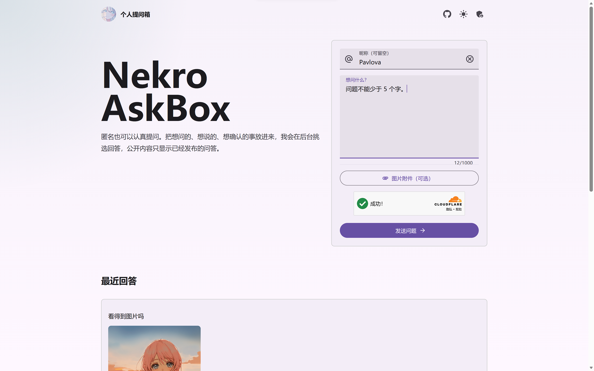
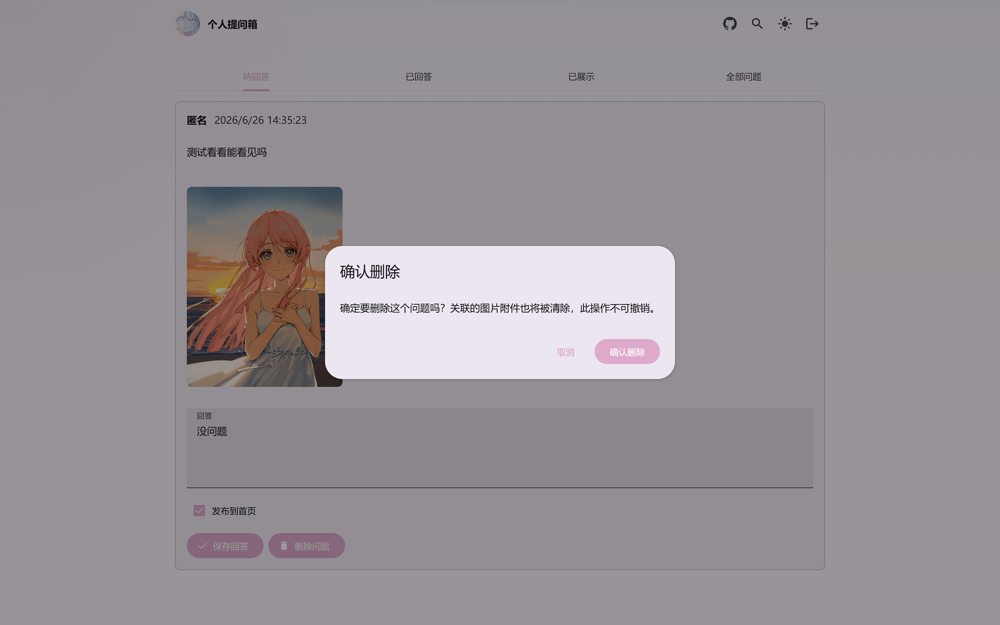
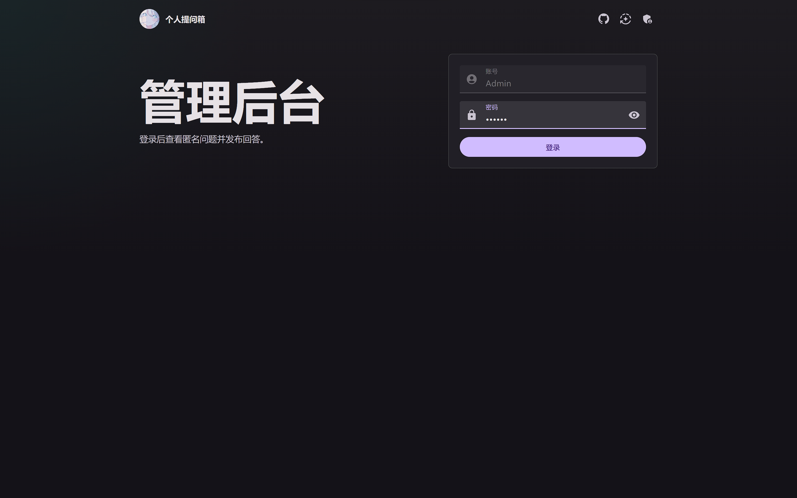

# 个人提问箱

一个可以直接上线使用的匿名提问箱网站，适合放在个人主页、博客、社交资料页里收集匿名问题。

## 预览

| 主页面 | 管理后台 | 登录页面 |
|--------|----------|----------|
|  |  |  |

## 技术栈

- Next.js App Router
- MDUI 2
- Cloudflare D1 / KV / R2 / Turnstile / Workers
- Algolia（可选搜索）

## 快速部署（使用 Agent）

本项目可用 [OpenCode](https://opencode.ai) 等 Agent 工具一键完成部署。在项目根目录向 Agent 发送：

```
复制 .env.example 为 .env.local，将 SESSION_SECRET 设为随机字符串，ADMIN_PASSWORD 设为你的密码。
创建项目所需的 Cloudflare 资源（D1、KV、R2）并更新 wrangler.jsonc 中的资源 ID。
初始化 D1 数据库。
通过 wrangler secret put 设置 SESSION_SECRET、ADMIN_PASSWORD、TURNSTILE_SECRET_KEY 生产密钥。
最后执行 npm run cf:deploy 部署到 Cloudflare Workers。
```

Agent 会自动完成以上步骤。部署完成后访问终端输出的 `workers.dev` 或自定义域名即可使用。

> **搜索功能（可选）** 需要额外的 Algolia 配置，详见下方 [Algolia 搜索配置](#algolia-搜索配置可选)。

## 手动部署

### 前置准备

- Node.js 22+
- [Wrangler](https://developers.cloudflare.com/workers/wrangler/) 已登录：`npx wrangler login`
- 一个 [Cloudflare](https://dash.cloudflare.com) 账号

### 1. 本地配置

```bash
cp .env.example .env.local
```

编辑 `.env.local`：

```env
SITE_NAME="个人提问箱"
SESSION_SECRET="换成一段很长的随机字符串"
ADMIN_PASSWORD="你的管理员密码"
NEXT_PUBLIC_TURNSTILE_SITE_KEY=""
TURNSTILE_SECRET_KEY=""
```

### 2. 创建 Cloudflare 资源

```bash
npx wrangler d1 create askbox-db              # D1 数据库
npx wrangler kv namespace create ASKBOX_KV     # KV 命名空间
npx wrangler r2 bucket create askbox-uploads   # R2 存储桶
```

将输出中的 `database_id` 和 `id` 填入 `wrangler.jsonc`。

### 3. 初始化数据库

```bash
npm run db:local   # 本地 D1
npm run db:remote  # 远端 D1（必须执行）
```

### 4. 设置生产密钥

```bash
echo '你的SESSION_SECRET' | npx wrangler secret put SESSION_SECRET
echo '你的ADMIN_PASSWORD' | npx wrangler secret put ADMIN_PASSWORD
echo '你的TURNSTILE_SECRET_KEY' | npx wrangler secret put TURNSTILE_SECRET_KEY
```

> 开发模式 Turnstile 可留空；生产环境请务必在 Cloudflare Dashboard 创建 Turnstile widget 并填入密钥。

### 5. 构建并部署

```bash
npm run cf:deploy
```

部署成功后会输出 `https://xxx.workers.dev` 访问地址。

## 功能特性

- **匿名提问**：支持公开昵称或匿名留言，可附带图片附件（PNG/JPG/WebP/GIF）
- **全文搜索**：基于 Algolia 的实时搜索，前台搜公开问题，后台搜全部（**可选功能**，见下方配置）
- **人机验证**：集成 Cloudflare Turnstile 验证，防止垃圾提交
- **深色模式**：顶部按钮一键切换浅色/深色/跟随系统，选择自动持久化
- **管理后台**：按状态分类（待回答/已回答/已展示/全部），支持按问题回答并选择公开
- **限速保护**：同一 IP 每小时最多提交 **20** 个问题，超出限制返回提示

## Algolia 搜索配置（可选）

搜索功能依赖 [Algolia](https://www.algolia.com/)，免费额度（10,000 条记录 / 10,000 次搜索/月）对个人使用完全足够。**不配置也不影响其他功能**，搜索栏会自动降级为空。

### 方式一：Agent 快速配置

在项目根目录向 Agent 发送：

```
配置 Algolia 搜索，我的 Application ID 是 XXX，
Search-Only API Key 是 XXX，
Admin API Key 是 XXX，
Index 名称是 askbox。
```

Agent 会自动完成：
1. 在 `.env.local` 中添加四项 Algolia 环境变量
2. 更新 `wrangler.jsonc` 的 `vars` 中添加三项公开变量
3. 通过 `wrangler secret put` 设置 `ALGOLIA_ADMIN_API_KEY`
4. 执行 `npm run cf:deploy` 重新部署

你也可以在同一句话里指定其他的 Index 名称。

### 方式二：手动配置

1. 前往 [algolia.com](https://www.algolia.com/) 注册账号
2. 进入 Dashboard → Settings → API Keys
3. 记录以下三个值：
   - **Application ID**
   - **Search-Only API Key**（公开，前端用）
   - **Admin API Key**（保密，后端用）

#### 2. 创建 Index

进入 Dashboard → Search → Index → Create Index，命名为 `askbox`（或其他你喜欢的名字）。

#### 3. 配置环境变量

在 `.env.local` 中添加：

```env
NEXT_PUBLIC_ALGOLIA_APP_ID="你的 Application ID"
NEXT_PUBLIC_ALGOLIA_SEARCH_ONLY_API_KEY="你的 Search-Only API Key"
NEXT_PUBLIC_ALGOLIA_INDEX="askbox"
ALGOLIA_ADMIN_API_KEY="你的 Admin API Key"
```

#### 4. 更新 wrangler.jsonc

在 `wrangler.jsonc` 的 `vars` 中添加三项公开变量（Admin Key 通过 secret 设置，**不要写进文件**）：

```json
{
  "vars": {
    "NEXT_PUBLIC_ALGOLIA_APP_ID": "你的 Application ID",
    "NEXT_PUBLIC_ALGOLIA_SEARCH_ONLY_API_KEY": "你的 Search-Only API Key",
    "NEXT_PUBLIC_ALGOLIA_INDEX": "askbox"
  }
}
```

#### 5. 设置 Admin API Key 为 Secret

```bash
echo '你的 Admin API Key' | npx wrangler secret put ALGOLIA_ADMIN_API_KEY
```

#### 6. 配置 Index 搜索属性（推荐）

在 Algolia Dashboard → Search → Index → `askbox` → Configuration → Searchable attributes 中，添加：

```
content, answer, nickname
```

这样搜索只会匹配问题内容、回答和昵称，结果更准确。

#### 7. 重新部署

```bash
npm run cf:deploy
```

部署后，新提交的问题会自动索引到 Algolia。已有数据不会自动同步，需重新提交或通过脚本导入。

## 管理后台

访问 `https://你的域名/admin`，使用 `ADMIN_PASSWORD` 登录。可查看待回答问题、填写回答并选择是否发布到首页。

## 本地运行

```bash
npm run dev
# http://localhost:3000
# http://localhost:3000/admin
```

## 项目命令

```bash
npm run dev        # 本地开发
npm run build      # Next.js 构建
npm run cf:build   # Cloudflare OpenNext 构建
npm run cf:preview # 本地预览 Workers 产物
npm run cf:deploy  # 部署到 Cloudflare Workers
npm run db:local   # 初始化本地 D1
npm run db:remote  # 初始化远端 D1
```

## 常见问题

### 提交问题时报错

检查 D1 是否已初始化、Turnstile 密钥是否正确、site key 是否已设置。

### 后台无法登录

- 检查 `ADMIN_PASSWORD` 和 `SESSION_SECRET` 是否已通过 `wrangler secret` 设置。
- 使用 `http://` 而非 `https://` 访问会导致 Cookie 无法写入，请务必通过 `https://` 访问后台。

### 部署后首页没有公开内容

正常。问题提交后进入后台收件箱，需要管理员回答并发布后才会显示。

### 搜索没有结果

- 确认已按上方步骤完成 Algolia 配置
- 确认 `ALGOLIA_ADMIN_API_KEY` 已设置为 secret
- 确认 Index 名称与 `NEXT_PUBLIC_ALGOLIA_INDEX` 一致
- 新提交的问题才会自动同步，旧数据不会自动导入

### Windows 构建失败

项目已内置 `@next/swc-wasm-nodejs` 作为 Windows fallback。如仍有问题，尝试：

```powershell
Remove-Item -Recurse -Force node_modules
Remove-Item -Force package-lock.json
npm install
```
