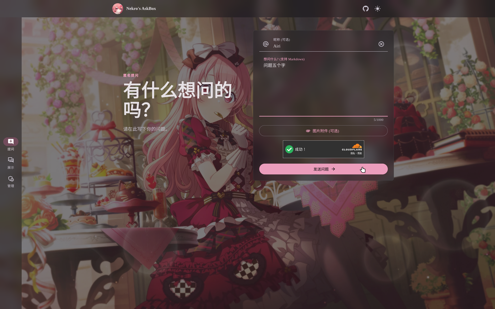
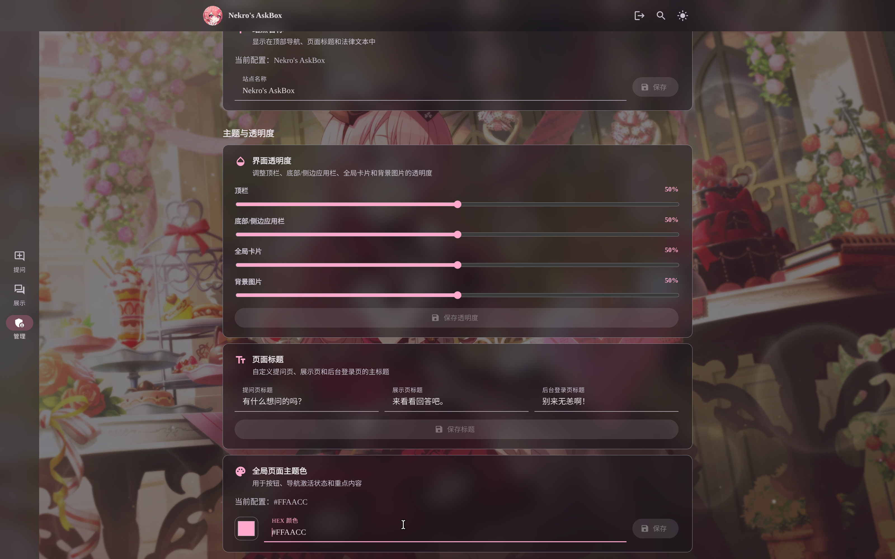
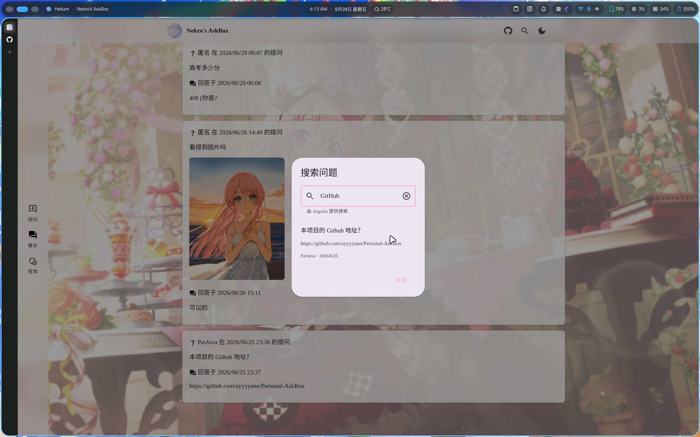

# 个人提问箱

一个可以直接上线使用的匿名提问箱网站，适合放在个人主页、博客、社交资料页里收集匿名问题。

## 预览

| 提问页 | 管理后台 | 搜索页面 |
|--------|----------|----------|
|  |  |  |

**DEMO:** https://askbox.nekro.top/

## 技术栈

- Next.js App Router
- MDUI 2
- Cloudflare D1 / KV / R2 / Turnstile / Workers
- Algolia（可选搜索）

## 快速部署（使用 Agent）

本项目可用 [OpenCode](https://opencode.ai) 等 Agent 工具一键完成部署。在项目根目录向 Agent 发送：

```
复制 .env.example 为 .env.local，将 SESSION_SECRET 设为随机字符串，ADMIN_PASSWORD 设为你的密码。
创建项目所需的 Cloudflare 资源（D1、KV、R2）并更新 wrangler.jsonc 中的资源 ID。
初始化 D1 数据库。
通过 wrangler secret put 设置 SESSION_SECRET、ADMIN_PASSWORD、TURNSTILE_SECRET_KEY 生产密钥。
最后执行 npm run cf:deploy 部署到 Cloudflare Workers。
```

Agent 会自动完成以上步骤。当前 `cf:deploy` 脚本固定使用 `askbox.nekro.top` 自定义域名；如需部署到自己的域名或使用 `workers.dev`，请先调整 `package.json` 中的部署脚本。

> **搜索功能（可选）** 需要额外的 Algolia 配置，详见下方 [Algolia 搜索配置](#algolia-搜索配置可选)。

## 手动部署

### 前置准备

- Node.js 22+
- [Wrangler](https://developers.cloudflare.com/workers/wrangler/) 已登录：`npx wrangler login`
- 一个 [Cloudflare](https://dash.cloudflare.com) 账号

### 1. 本地配置

```bash
cp .env.example .env.local
```

编辑 `.env.local`：

```env
SITE_NAME="个人提问箱"
# 当前版本的站点名称请在 /admin/settings 中修改；此变量为旧版本遗留配置
SESSION_SECRET="换成一段很长的随机字符串"
# 本地测试可使用 admin；实际部署前必须替换为自定义强密码
ADMIN_PASSWORD="admin"
NEXT_PUBLIC_TURNSTILE_SITE_KEY=""
TURNSTILE_SECRET_KEY=""
```

本地开发时，如果没有配置 `ADMIN_PASSWORD`，管理员登录也会使用初始密码 **`admin`**。访问 `/admin` 即可测试登录流程。实际部署时请务必设置自定义强密码，不能使用此默认密码。

### 2. 创建 Cloudflare 资源

```bash
npx wrangler d1 create askbox-db              # D1 数据库
npx wrangler kv namespace create ASKBOX_KV     # KV 命名空间
npx wrangler r2 bucket create askbox-uploads   # R2 存储桶
```

将输出中的 `database_id` 和 `id` 填入 `wrangler.jsonc`。

### 3. 初始化数据库

```bash
npm run db:local   # 本地 D1
npm run db:remote  # 远端 D1（必须执行）
```

### 4. 设置生产密钥

```bash
echo '你的SESSION_SECRET' | npx wrangler secret put SESSION_SECRET
echo '你的ADMIN_PASSWORD' | npx wrangler secret put ADMIN_PASSWORD
echo '你的TURNSTILE_SECRET_KEY' | npx wrangler secret put TURNSTILE_SECRET_KEY
```

> 开发模式 Turnstile 可留空；生产环境请务必在 Cloudflare Dashboard 创建 Turnstile widget 并填入密钥。

### 5. 构建并部署

```bash
npm run cf:deploy
```

部署成功后会输出 `https://xxx.workers.dev` 访问地址。

## 功能特性

- **匿名提问**：支持公开昵称或匿名留言，可附带图片附件（PNG/JPG/WebP/GIF）
- **全文搜索**：基于 Algolia 的实时搜索，前台搜公开问题，后台搜全部（**可选功能**，见下方配置）
- **人机验证**：集成 Cloudflare Turnstile 验证，防止垃圾提交
- **深色模式**：顶部按钮一键切换浅色/深色/跟随系统，选择自动持久化
- **响应式导航与页面过渡**：桌面端使用左侧导航栏，移动端使用底部导航栏，站内页面切换采用客户端过渡动画，并尊重系统减少动态效果设置
- **管理后台**：登录后从后台主页进入问题列表和自定义设置；问题列表按状态分类（待回答/已回答/已展示/全部），支持回答、发布、删除问题，关联附件同步清理
- **限速保护**：同一 IP 每小时最多提交 **20** 个问题，超出限制返回提示
- **Markdown 支持**：问题和回答均支持 Markdown 语法，含加粗、斜体、链接、列表等，自动渲染为规范格式
- **快速复制**：点击公开展示页问答卡片一键复制问答内容，Snackbar 提示已复制
- **自定义站点外观与文案**：管理员可修改站点名称、提问页标题、展示页标题、后台登录页标题、主题色、favicon、背景图片和页脚版权名称
- **自定义 404 页面**：不存在的路径显示统一风格页面，并提供返回提问页入口

## 页面与路由

| 路径 | 用途 | 访问权限 |
|------|------|----------|
| `/` | 自动重定向到 `/ask` | 公开 |
| `/ask` | 匿名提问、填写昵称、Markdown 和图片附件 | 公开 |
| `/display` | 查看已回答并公开的问题 | 公开 |
| `/search?q=关键词` | 搜索已公开的问题 | 公开 |
| `/admin` | 管理员登录；登录后进入后台主页 | 登录后显示管理菜单 |
| `/admin/questions` | 查看、回答、发布或删除问题 | 需要管理员登录 |
| `/admin/settings` | 修改站点信息、页面标题和视觉设置 | 需要管理员登录 |
| `/terms` | 查看用户协议 | 公开 |
| `/privacy` | 查看隐私政策 | 公开 |
| 其他不存在路径 | 自定义 404 页面 | 公开 |

管理后台和公共页面共用“提问、展示、管理”主导航。后台主页另提供“问题列表”和“自定义设置”入口。

## Algolia 搜索配置（可选）

搜索功能依赖 [Algolia](https://www.algolia.com/)，免费额度（10,000 条记录 / 10,000 次搜索/月）对个人使用完全足够。**不配置也不影响其他功能**，搜索栏会自动降级为空。

顶部搜索按钮会打开搜索对话框，`/search?q=关键词` 也提供独立搜索页面。公共页面和独立搜索页只返回已公开的问题；管理员登录后，后台页面顶部搜索对话框可以搜索全部状态的问题。公共导航中没有单独的搜索导航项。

### 方式一：Agent 快速配置

在项目根目录向 Agent 发送：

```
配置 Algolia 搜索，我的 Application ID 是 XXX，
Search-Only API Key 是 XXX，
Admin API Key 是 XXX，
Index 名称是 askbox。
```

Agent 会自动完成：
1. 在 `.env.local` 中添加四项 Algolia 环境变量
2. 更新 `wrangler.jsonc` 的 `vars` 中添加三项公开变量
3. 通过 `wrangler secret put` 设置 `ALGOLIA_ADMIN_API_KEY`
4. 执行 `npm run cf:deploy` 重新部署

你也可以在同一句话里指定其他的 Index 名称。

### 方式二：手动配置

1. 前往 [algolia.com](https://www.algolia.com/) 注册账号
2. 进入 Dashboard → Settings → API Keys
3. 记录以下三个值：
   - **Application ID**
   - **Search-Only API Key**（公开，前端用）
   - **Admin API Key**（保密，后端用）

#### 2. 创建 Index

进入 Dashboard → Search → Index → Create Index，命名为 `askbox`（或其他你喜欢的名字）。

#### 3. 配置环境变量

在 `.env.local` 中添加：

```env
NEXT_PUBLIC_ALGOLIA_APP_ID="你的 Application ID"
NEXT_PUBLIC_ALGOLIA_SEARCH_ONLY_API_KEY="你的 Search-Only API Key"
NEXT_PUBLIC_ALGOLIA_INDEX="askbox"
ALGOLIA_ADMIN_API_KEY="你的 Admin API Key"
```

#### 4. 更新 wrangler.jsonc

在 `wrangler.jsonc` 的 `vars` 中添加三项公开变量（Admin Key 通过 secret 设置，**不要写进文件**）：

```json
{
  "vars": {
    "NEXT_PUBLIC_ALGOLIA_APP_ID": "你的 Application ID",
    "NEXT_PUBLIC_ALGOLIA_SEARCH_ONLY_API_KEY": "你的 Search-Only API Key",
    "NEXT_PUBLIC_ALGOLIA_INDEX": "askbox"
  }
}
```

#### 5. 设置 Admin API Key 为 Secret

```bash
echo '你的 Admin API Key' | npx wrangler secret put ALGOLIA_ADMIN_API_KEY
```

#### 6. 配置 Index 搜索属性（推荐）

在 Algolia Dashboard → Search → Index → `askbox` → Configuration → Searchable attributes 中，添加：

```
content, answer, nickname
```

这样搜索只会匹配问题内容、回答和昵称，结果更准确。

#### 7. 重新部署

```bash
npm run cf:deploy
```

部署后，新提交的问题会自动索引到 Algolia。已有数据不会自动同步，需重新提交或通过脚本导入。

## 管理后台

访问 `https://你的域名/admin`，使用 `ADMIN_PASSWORD` 登录。登录后可从后台主页进入问题列表，填写回答并选择是否发布到公开展示页。

进入 `/admin/settings` 可以通过列表逐项配置：

- 站点名称
- 提问页、展示页和后台登录页标题
- 全局页面主题色
- 主页面头像（favicon）上传与更换
- 全局背景图片上传、替换与清除
- 页脚版权名称
- 还原默认配置

站点名称和页脚版权名称最多 80 个字符；三个页面标题最多 120 个字符；主题色必须为 `#RRGGBB` 格式。favicon 支持 PNG、JPG、WebP、ICO，最大 1MB；背景图片支持 PNG、JPG、WebP，最大 4MB。还原默认配置会重置以上文字和视觉设置，并删除已上传的 favicon、背景图片，但不会删除问题数据。

头像和背景图片使用现有 `ASKBOX_R2` 绑定，分别保存到 `site-assets/favicon/` 和 `site-assets/background/`，不需要创建新的 R2 bucket。设置记录保存于 D1 的 `site_settings` 表。

站点名称当前以 D1 中的设置为准，`SITE_NAME` 是旧版本遗留环境变量，不再控制运行时页面名称。已有部署如曾通过 `SITE_NAME` 设置过自定义名称，需要在 `/admin/settings` 中重新保存。用户协议和隐私政策中的站点名称来自设置，网址根据当前访问域名生成，不需要额外配置 `SITE_URL`。

## 本地运行

```bash
npm run dev
# http://localhost:3000
# http://localhost:3000/ask
# http://localhost:3000/display
# http://localhost:3000/search?q=关键词
# http://localhost:3000/admin
```

根路径 `/` 会自动跳转到 `/ask`。本地开发时，`http://localhost` 可以正常使用登录 Cookie；生产环境后台应通过 HTTPS 访问。

## 项目命令

```bash
npm run dev        # 本地开发
npm run build      # Next.js 构建
npm run cf:build   # Cloudflare OpenNext 构建
npm run cf:preview # 本地预览 Workers 产物
npm run cf:deploy  # 部署到 Cloudflare Workers
npm run db:local   # 初始化本地 D1
npm run db:remote  # 初始化远端 D1
```

如果数据库已经存在，请在部署设置功能前执行一次完整 schema 初始化（命令使用 `INSERT OR IGNORE`，不会覆盖已有设置）：

```bash
npm run db:local
npm run db:remote
```

后续版本化迁移可使用：

```bash
npm run db:migrate:local
npm run db:migrate:remote
```

当前仓库尚未提供 `migrations/` 或 `db/migrations/` 下的版本化 SQL 文件，`db:migrate:*` 暂不能替代完整 schema 初始化。`db:local` 只更新本地 D1，`db:remote` 才会更新 Cloudflare 远端 D1。设置功能使用前必须确认目标环境已存在 `site_settings` 表；初始化不会删除问题数据，也不会创建新的 Cloudflare 资源。

## 法律与隐私

公共页面页脚提供 **用户协议** 与 **隐私政策** 入口，以对话框形式展示，也可通过 `/terms` 和 `/privacy` 直接访问。管理后台不显示公共页脚。法律文本中的站点名称来自 `/admin/settings`，网址根据当前访问域名动态生成；部署在反向代理后时，请确保正确转发 Host 和协议头。

## 许可协议

本项目遵循 **MIT license** 开源协议，详细查看 [LICENSE](LICENSE) 文件。

> Copyright (c) 2026 Nekro

根据 MIT 开源协议，你可以自由使用、修改、分发代码，但需保留上述版权声明。

## 常见问题

### 提交问题时报错

检查 D1 是否已初始化、Turnstile 密钥是否正确、site key 是否已设置。

### 后台无法登录

- 检查 `ADMIN_PASSWORD` 和 `SESSION_SECRET` 是否已通过 `wrangler secret` 设置。
- 本地开发默认密码为 `admin`；生产环境不会启用未配置密码时的默认回退。
- 生产环境后台应通过 HTTPS 访问；本地开发的 `http://localhost` 可以正常使用登录 Cookie。

### 部署后展示页没有公开内容

正常。问题提交后进入后台收件箱，需要管理员回答并发布后才会显示在 `/display` 展示页。

### 搜索没有结果

- 确认已按上方步骤完成 Algolia 配置
- 确认 `ALGOLIA_ADMIN_API_KEY` 已设置为 secret
- 确认 Index 名称与 `NEXT_PUBLIC_ALGOLIA_INDEX` 一致
- 新提交的问题才会自动同步，旧数据不会自动导入

### Windows 构建失败

项目已内置 `@next/swc-wasm-nodejs` 作为 Windows fallback。如仍有问题，尝试：

```powershell
Remove-Item -Recurse -Force node_modules
Remove-Item -Force package-lock.json
npm install
```
